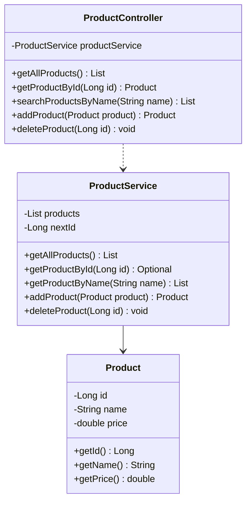

```mermaid
classDiagram
  class Product {
    -Long id
    -String name
    -double price
    +getId() Long
    +getName() String
    +getPrice() double
  }

  class ProductController {
    -ProductService productService
    +getAllProducts() List<Product>
    +getProductById(Long id) Product
    +searchProductsByName(String name) List<Product>
    +addProduct(Product product) Product
    +deleteProduct(Long id) void
  }

  class ProductService {
    -List<Product> products
    -Long nextId
    +getAllProducts() List<Product>
    +getProductById(Long id) Optional<Product>
    +getProductByName(String name) List<Product>
    +addProduct(Product product) Product
    +deleteProduct(Long id) void
  }

  ProductController ..> ProductService
  ProductService --> Product
```